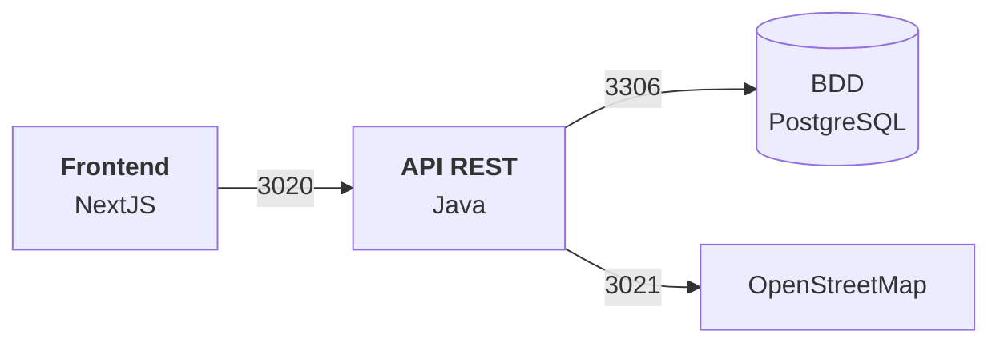

# Cahier des charges

## Présentation de l’équipe

- **Mathurin Hauville**
    - BDD, Back-end
- **Moetez Jaoued**
    - Back-end, Front-end
- **Gatien Bertin**
    - BDD, Front-end

## Configuration de l'environnement de développement

### Base de données

Lancer la base de données :

```bash
make db_up
```

Restaurer la dernière sauvegarde :

```bash
make restore
```

Exporter la base de données

```bash
make dump
```

# 1. **Présentation du projet**

## 1.1. Contexte

La ville de Brest propose un environnement riche pour les jeunes (étudiants, nouveaux arrivants, stagiaires…).
Toutefois, les ressources disponibles se trouvent souvent éparpillées sur différents sites (offres de stages,
événements, tourisme, etc.).

L’idée est de créer une plateforme « tout-en-un » centralisant toutes les informations utiles pour les étudiants et
jeunes actifs à Brest :

- Endroits à visiter (tourisme, patrimoine, activités culturelles et sportives)
- Offres de stages, alternances et jobs étudiants dans la région
- Agenda des événements (festivals, salons, soirées étudiantes, etc.)
- Bon plans et réductions possible en tant qu’étudiant à Brest chez différents commerçant et services (restaurant,
  cinéma, salle de sport, etc.)

## 1.2. Objectifs

- **Centraliser l’information**
    - Offrir une plateforme unique où les jeunes peuvent trouver rapidement tout ce dont ils ont besoin pour découvrir
      la ville, faire des recherches de stages et participer à des événements.
- **Promouvoir la ville de Brest**
    - Mettre en avant le dynamisme culturel et économique de Brest à travers les activités et opportunités qu’elle
      propose.
- **Simplifier l’accès à l’information**
    - Proposer une interface ergonomique et intuitive facilitant la navigation et la recherche d’informations.
- **Favoriser l’engagement***
    - Encourager l’interaction entre les utilisateurs et les acteurs locaux (universités, entreprises, associations,
      etc.).

---

# 2. **Cas d’utilisation (Use Cases)**

**Usager principal** : l’Étudiant / Jeune actif

### **Consulter les lieux à visiter**

- **Description** : l’utilisateur souhaite découvrir les lieux incontournables de Brest (musées, lieux historiques,
  parcs, etc.).
- **Acteurs** : utilisateur, module « Découverte ».
- **Actions** :
    1. L’utilisateur visualise la rubrique « Découverte ».
    2. Le système affiche la liste des lieux.
    3. L’utilisateur peut consulter les détails (horaires, tarifs).

### **Rechercher une offre de stage / alternance**

- **Description** : l’utilisateur souhaite trouver un stage, une alternance ou un job étudiant à Brest et alentours.
- **Acteurs** : utilisateur, module « Offres d’emplois ».
- **Actions** :
    1. L’utilisateur navigue vers la rubrique « Offres d’emplois ».
    2. Le système affiche la liste des offres présentent actuellement.
    3. L’utilisateur consulte les offres, postule si possible via un lien.

### **Consulter l’agenda des événements / soirées étudiantes**

- **Description** : l’utilisateur veut connaître les événements festifs, culturels ou sportifs à venir.
- **Acteurs** : utilisateur, module « Événements »
- **Actions** :
    1. L’utilisateur accède à la rubrique « Événements ».
    2. Le site affiche une liste avec les événements à venir.
    3. L’utilisateur peut filtrer (type d’événement, date, lieu), et éventuellement s’inscrire ou acheter un billet si
       un système de billetterie est implémenté.

### **Consulter les bons plans du moments**

- **Description** : l'utilisateur souhaite découvrir les réductions et avantages disponibles pour les étudiants.
- **Acteurs** : utilisateur, module « Bon plans »
- **Actions** :
    1. L'utilisateur accède à la rubrique « Bon plans ».
    2. Le système affiche la liste des offres et réductions disponibles.
    3. L'utilisateur peut filtrer par catégorie et consulter les détails de chaque offre.

---

# 3. **Diagramme d’architecture : vision globale du système**



---

# 4. **Résultat attendu côté Front : spécifications et livrables**

## 4.1. **Ergonomie & Design**

1. **Page d’accueil** :
    - Doit comporter un menu de navigation clair vers :
        - Découverte
        - Offres emplois
        - Événements
        - Bon plans
2. **Page « Découverte »** :
    - Liste des lieux avec photos, description brève, bouton « En savoir plus » pour accéder aux détails.
    - Option de filtrer (par type, localisation, distance, gratuit / payant…).
    - Carte intégrée (Google Maps, OpenStreetMap) pour géolocaliser les lieux.
3. **Page « Offres emplois »** :
    - Liste des offres en cours actuellement
    - Option de filtrer (type CDI/CDD/Stage/…, domaine, date de début…).
    - Fiches détaillées consultable avec contacts, description du poste, lien pour postuler.
4. **Page « Événements »** :
    - Vue calendrier et/ou liste.
    - Fiches événements : date, lieu, organisateur, prix (si payant), durée, lien d’inscription ou d’achat de billet.
5. **Page « Bon plans » :**
    - Liste des commerces/services avec description brève des avantages proposés et un lien vers l’offre
    - Option de filtrer (entité commerce/transport/… , date, réduction)
6. **Responsive Design** :
    - Le site doit s’adapter automatiquement aux écrans mobiles, tablettes, ordinateurs.
    - Navigation et accès aux fonctionnalités simples même sur smartphone (important pour un public étudiant).

## 4.2. **Exigences techniques**

- **Frameworks conseillés** :
    - Frontend : Next.js
    - Backend : Java SpringBoot
    - **Base de données** :  PostgreSQL
- **API tierces** :
    - **Cartographie:** OpenStreetMap.
- **Sécurité & RGPD** :
    - Mise en conformité RGPD (mentions légales, politique de confidentialité, consentement cookies).
    - Sécuriser les données personnelles des utilisateurs (mots de passe hashés, protection contre injections SQL,
      etc.).